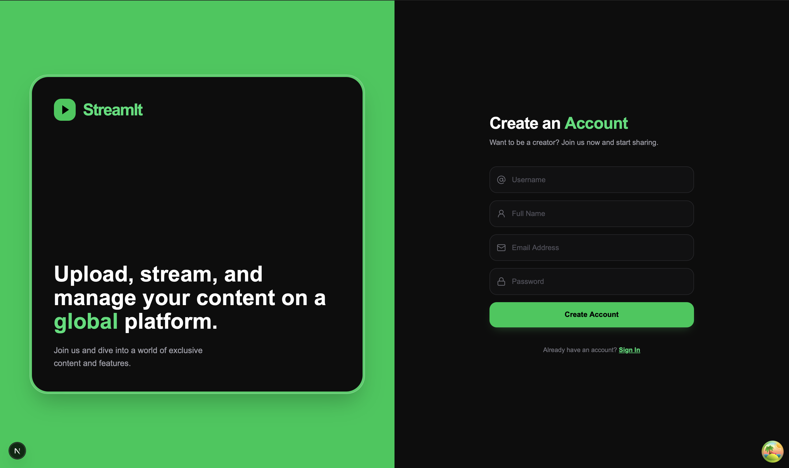

# StreamIt Frontend

A modern video streaming platform frontend built with Next.js.  
Supports video upload, processing pipeline, dashboard management, and real-time search.

---

## Tech Stack

- Next.js
- React
- TypeScript
- Tailwind CSS
- TanStack Query

---

## Features

- Authentication (JWT-based)
- Video upload (S3 presigned URLs)
- HLS video playback

- SSR-powered home feed for fast initial load
- CSR dashboard with real-time updates
- Smart polling for video processing status
- Client-side caching & background refetching (TanStack Query)
- Automatic retries & error handling

- Debounced search
- User profile