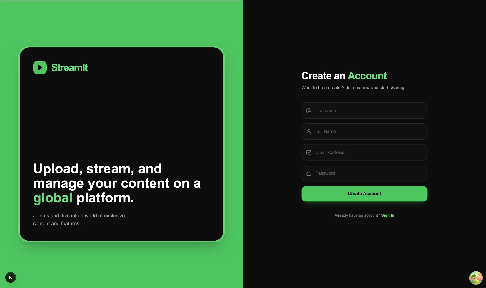

# StreamIt Frontend

A modern distributed video streaming platform frontend built with Next.js.
Supports video uploads, adaptive HLS playback, creator dashboards, real-time analytics, and server-rendered content.

---

## Tech Stack

- Next.js
- React
- TypeScript
- Tailwind CSS
- TanStack Query

---

## Features

- JWT Authentication
- Direct-to-S3 video uploads (Presigned URLs)
- Adaptive HLS video playback
- Server-Side Rendered home feed
- Client-side dashboard with smart polling
- Real-time video processing status
- Redis-backed distributed view counting
- Like, comment & subscription system
- Channel pages & creator profiles
- Debounced search
- Client-side caching & background refetching
- Automatic retries & error handling

---

## Backend

The frontend communicates with a distributed Go backend featuring:

- FFmpeg media processing workers
- AWS S3 object storage
- Redis Streams event processing
- HyperLogLog-based unique viewer analytics
- Write-behind view aggregation
- MongoDB persistence
